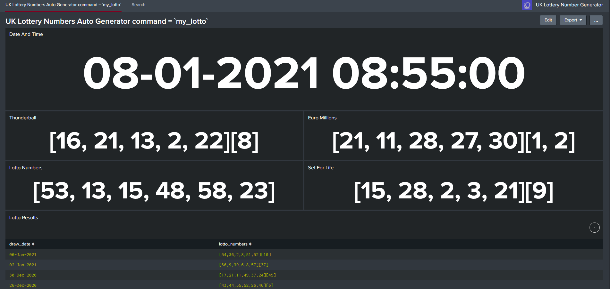

UK Lottery Number Generator

App = dc_lottery_gen_app

I was dreaming about winning the lottery, just like you! But the reality is very very unlikely, that said one can still dream.

I then  started by ingesting the lottery result numbers to see if I could find a pattern of numbers, but again dreaming!…So I ended up creating this auto number generator, and added the python script as a command. So just a bit of fun under-lock down.

The screen shot below shows the numbers for the four lottery games, and I’ve ingested results from one of the games called Lotto. The numbers get automatically generated every 5 minutes or you can run the macro command "`my_lotto`" and get some instance numbers and use this should you play.

Install:
Download and extract the app, then install onto a search head, ensure you have the "lottery" index setup and it should be good to go.

Config:
A python script generates the random numbers for all the four games, and the data gets ingested into an index every 5 minutes.

Another python script downloads from the National Lottery a csv file containing 180 days’ worth of results from the Lotto game, this runs 13:00 hours each day, the data is put intot he lookups folder.

Ensure you have the below indexes setup and have a read of the inputs.conf and props.conf to get familiar with the config. See the bin folder for the python scripts.

index=lottery  

Note:
I only tested this with Splunk version 8.x which comes with python 3

So this shows you that you can ingest almost any kind of data and have a little fun!

Dee
